# Phase 01 : 5 Oct 2027

## PR Review Crew

PR Review Crew is a GitHub App that provides an asynchronous foundation for automated pull request reviews. When a pull request is opened or updated, GitHub sends a signed webhook to a FastAPI service, which verifies the request, filters relevant events, prevents duplicate processing, and queues a review job in Redis. An Arq worker then processes the job, authenticates with GitHub using an installation token, creates an in-progress check, and posts a review-started comment. The current implementation simulates the review process before completing the check successfully. The project is designed as the infrastructure for integrating a real automated code-review engine in the next stage.

### Tech stack
- Python — core programming language
- FastAPI — webhook API server
- Redis — job queue and delivery deduplication
- Arq — asynchronous background job worker
- httpx — asynchronous HTTP client for GitHub API
- GitHub Apps & GitHub REST API — webhook integration, authentication, checks, and PR comments
- HMAC-SHA256 — webhook signature verification
- PyJWT — GitHub App JWT authentication
- Docker / Docker Compose — Redis containerisation
- Uvicorn — FastAPI ASGI server
- Pytest — security/unit testing
- ngrok — exposing the local FastAPI server to GitHub webhooks

**GitHub App installed for testing at :**
https://github.com/Kaveeshakavindi/pr-crew-playground.git

### Flow
```
PR opened
   ↓
FastAPI receives webhook
   ↓
Redis
   ↓
Arq worker
   ↓
Get GitHub installation token
   ↓
Create "PR Review Crew" check
   ↓
Comment "👋 Review started"
   ↓
WAIT 2 SECONDS          ← fake review
   ↓
Mark check "success"    ← regardless of code
```
---
you need to install redis on your pc

```bash
brew install redis
```

then run it

```bash
brew services start redis
```

check if it is running

```bash
redis-cli ping
```

OR

Start redis via docker compose
- include redis config in docker-compose.yml
- go to project directory
- and run;

```bash
docker compose up -d
```

check if redis is running

```bash
docker compose ps
```

stop redis when finished

```bash
docker compose down
```

---

start python web application (fast api)

```bash
uvicorn app.main:app --reload
```

---

Run ngrok agent endpoint from command line
```bash
ngrok http 8000 --url https://<abc123>.ngrok-free.dev
```

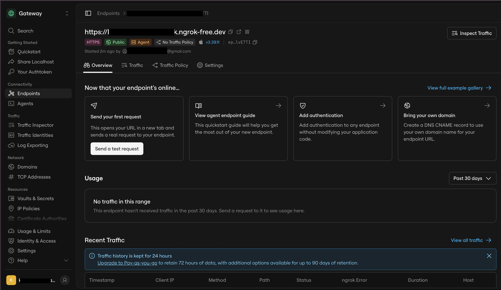

---

---

Start the worker
```bash
python -m arq app.worker.WorkerSettings
```
---

### GitHub App settings

In your GitHub App settings:

- Webhook URL: https://<your-ngrok-domain>/webhooks
- Webhook secret: a long random string, which also goes in .env
- Permissions: Checks (read and write), Pull requests (read and write), Contents (read), Metadata (read)
- Events: Pull request
- Install the app on your test repo.

---

### Security

Added security to make sure that the webhook request really came from GitHub and wasn't modified by someone else because anyone who knows the ngrok public URL could potentially send a fake request.

Concept:
When GitHub sends a webhook, it takes the exact raw request body and calculates an HMAC-SHA256 signature using that secret.

```
request
   ↓
await request.body()
   ↓
verify signature
   ↓
signature valid?
   ↓ YES
json.loads()
   ↓
process webhook
```

--- 

Run tests

```bash
python -m pytest
```
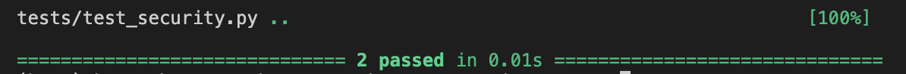


### Test : Fast API enqueue job

1. Redis

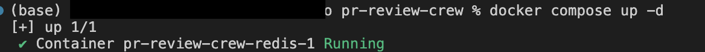

2. Fast API

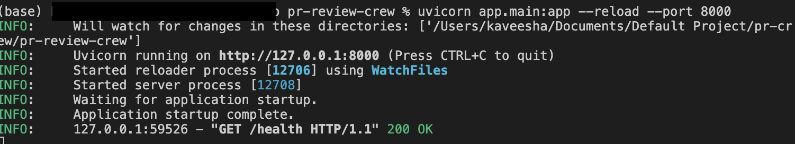

3. Arq Worker

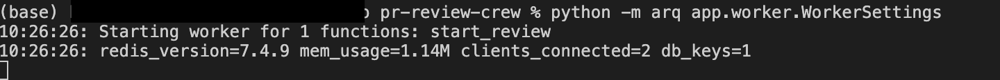

3. Health Check

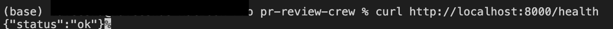

4. Test webhook payload

```bash
python - <<'PY'
import json
import hmac
import hashlib
import subprocess

secret = "YOUR_WEBHOOK_SECRET"

payload = {
    "action": "opened",
    "installation": {
        "id": 12345678
    },
    "repository": {
        "owner": {
            "login": "test-owner"
        },
        "name": "test-repo"
    },
    "pull_request": {
        "number": 1,
        "head": {
            "sha": "abc123"
        }
    }
}

body = json.dumps(payload).encode()

signature = "sha256=" + hmac.new(
    secret.encode(),
    body,
    hashlib.sha256
).hexdigest()

subprocess.run([
    "curl",
    "-X", "POST",
    "http://localhost:8000/webhooks",
    "-H", "Content-Type: application/json",
    "-H", "X-GitHub-Event: pull_request",
    "-H", "X-GitHub-Delivery: test-delivery-001",
    "-H", f"X-Hub-Signature-256: {signature}",
    "-d", body
])
PY
```
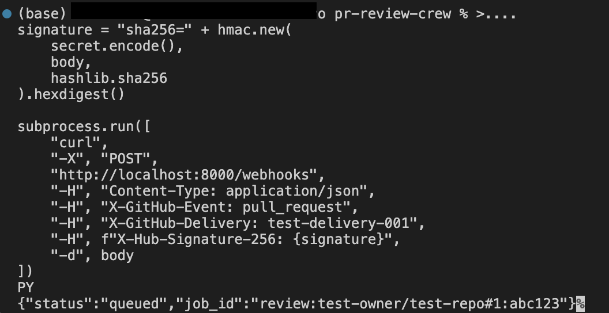

5. Run above command again to test job-ID deduplication.

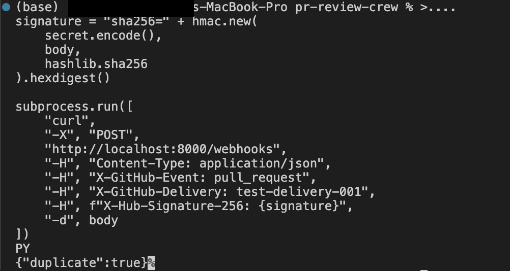

6. Run above command again to test delievery-ID deduplication.

7. Test if Arq worker received the job and attempted in arq worker running terminal

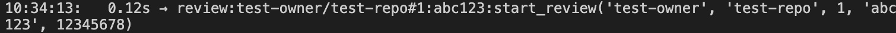

8. GitHub Test with real repository

- create new branch in hit hub app installed test repo.
- commit and push changes.
- open a new pull request.
- at success, it will show below message.

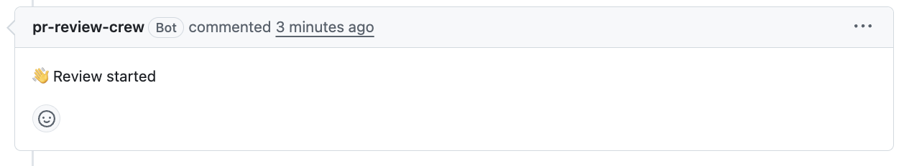

### So the webhook successfully:

1. Received the request.
2. Verified the HMAC signature.
3. Recognized it as a pull_request + opened event.
4. Passed the delivery deduplication check.
5. Extracted the PR information.
6. Created job ID.
7. Put the job into Redis.
8. Returned 202 Accepted immediately.

---

# Phase 02 : 8 Oct 2027

## AI Reviewer Flow

```
1. Fetch PR diff
        ↓
2. Extract changed files / hunks
        ↓
3. Send diff to LLM
        ↓
4. Receive structured JSON
        ↓
5. Decide whether findings exist
        ↓
6. Post findings as GitHub comments
        ↓
7. Complete GitHub Check
```

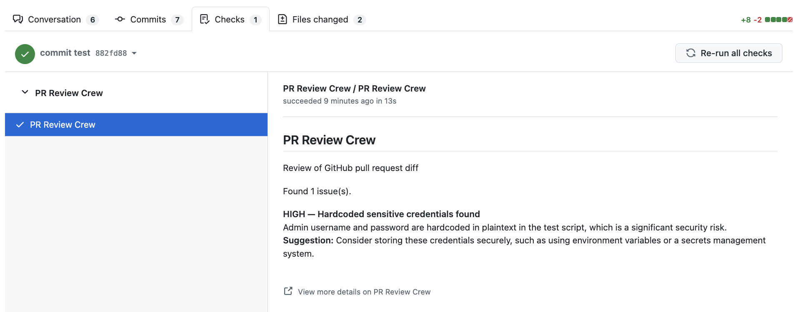

---

System Architecture

```
                         GitHub PR
                           ↓
                        Webhook
                           ↓
                        FastAPI
                           ↓
                        Redis / Arq
                           ↓
                        Worker
                           ↓
                        GitHub Diff
                           ↓
                        LLM Reviewer
                           ↓
                        Structured Pydantic Output
                           ↓
                        GitHub Check
```

